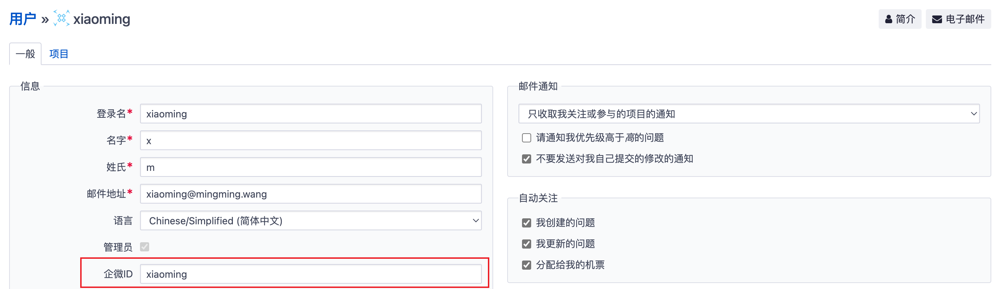

# 简介

企业微信通知插件，支持特性如下：

* 支持版本：Redmine 5.x
* 新建问题通知
* 更新问题通知
* `redmine:send_work_wechat` 定期任务通知待完成任务
* 按账号设置 “不要发送对我自己提交的修改的通知”，与 “邮件通知 > 不要发送对我自己提交的修改的通知” 共用同一个配置
* 使用默认浏览器打开通知链接
* 自定义 `Redmine 用户` 与 `企业微信 用户` 的关联方式
* 超长内容自动分割为多次发送 // TODO
* 限制问题详情内容长度 // TODO

# 安装

1. 安装插件
```bash
cd ${REDMINE_ROOT}/plugins
git clone https://github.com/mingming-cn/redmine_work_wechat.git`
cd ..
bundle exec rake redmine:plugins:migrate RAILS_ENV=production
```
2. 进入插件页面配置相关参数，管理 > 插件 > Redmine Work Wechat plugin > 配置
3. 当 `“用户关联类型”` 选择 `“自定义”` 时请在用户资料中配置 `“企微ID”` 字段

## 用户关联类型
可以选择 `Redmine 用户` 与 `企业微信 用户` 的关联方式，默认为通过邮箱关联，可选项：`邮箱`、`登录名`、`自定义(需要在用户资料里配置)`



## 使用默认浏览器打开通知链接

开启功能前，需在企业微信管理后台，在应用管理 “网页授权及JS-SDK” 功能中，把 Redmine 系统的域名配置为可信域名。

# Task 

## 使用方法

> Available options:
> * :days     => how many days in the future to remind about (defaults to 7)
> * :tracker  => id of tracker for filtering issues (defaults to all trackers)
> * :project  => id or identifier of project to process (defaults to all projects)
> * :users    => array of user/group ids who should be reminded
> * :version  => name of target version for filtering issues (defaults to none)

```bash
rake redmine:send_work_wechat days=10 RAILS_ENV="production"
```
## 通知效果


# 截图

## 插件配置


## 新问题通知


## 问题更新通知


## 定期任务通知

