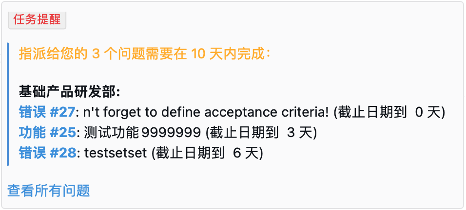
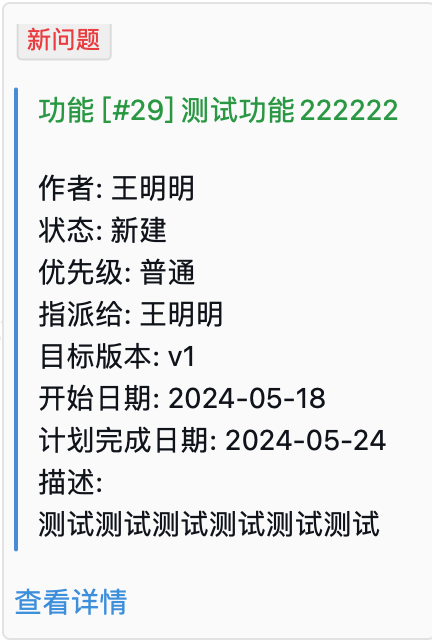
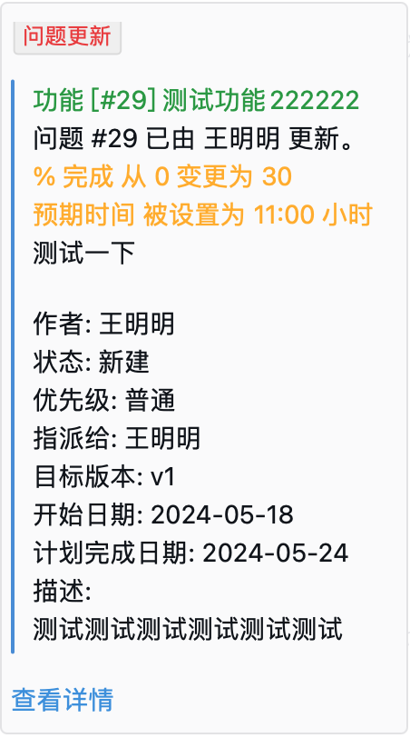

# 简介

企业微信通知插件，支持特性如下：

* 支持 Redmine 5.x
* 新建问题通知
* 更新问题通知
* `redmine:send_work_wechat` 定期任务通知待完成任务
* 支持按账号设置 “不要发送对我自己提交的修改的通知”，与 “邮件通知 > 不要发送对我自己提交的修改的通知” 共用同一个配置
* 支持 “使用默认浏览器打开通知链接” 

# 安装

1. `cd ${REDMINE_ROOT}/plugins`
2. `git clone https://github.com/mingming-cn/redmine_work_wechat.git`
3. 进入插件页面配置相关参数，管理 > 插件 > Redmine Work Wechat plugin > 配置


## 特殊功能配置

### 使用默认浏览器打开通知链接

请在企业微信应用 “网页授权及JS-SDK” 功能中，把 Redmine 系统的域名配置为可信域名。

# Task 

## 使用方法
> Available options:
> * :days     => how many days in the future to remind about (defaults to 7)
> * :tracker  => id of tracker for filtering issues (defaults to all trackers)
> * :project  => id or identifier of project to process (defaults to all projects)
> * :users    => array of user/group ids who should be reminded
> * :version  => name of target version for filtering issues (defaults to none)

```bash
rake redmine:send_work_wechat days=10 RAILS_ENV="production"
```
## 通知效果


# 截图

## 插件配置


## 新问题通知


## 问题更新通知


## 定期任务通知

