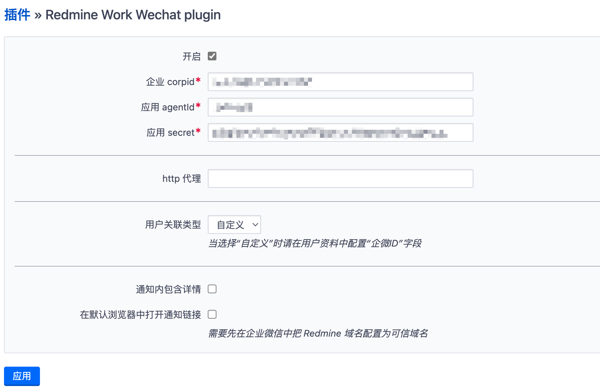

# 简介

企业微信通知插件，支持特性如下：

* 新建问题通知
* 更新问题通知
* `redmine:send_work_wechat` 定期任务通知待完成任务

# 安装

1. `cd ${REDMINE_ROOT}/plugins`
2. `git clone https://github.com/mingming-cn/redmine_work_wechat.git`
3. 进入插件页面配置相关参数，管理 > 插件 > Redmine Work Wechat plugin > 配置

# 截图

## 插件配置

## 新问题通知

## 问题更新通知

## 定期任务通知

